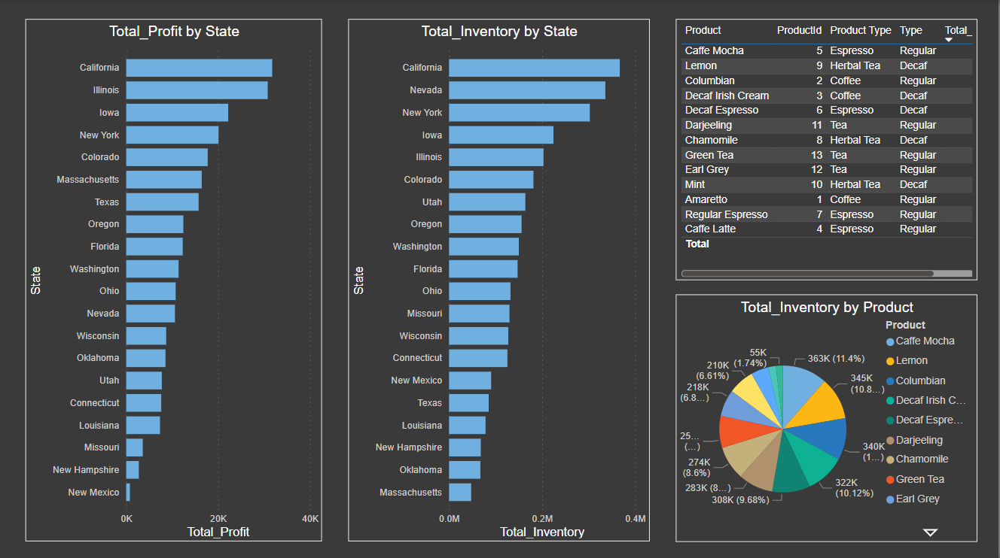
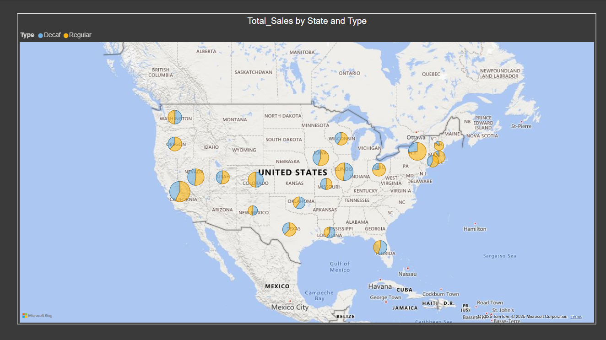

# ☕ Power BI Coffee Chain Dashboard

## 📘 Project Overview

This project showcases a highly interactive and insightful **Power BI dashboard** developed to analyze a coffee chain’s overall business performance. Leveraging a CSV dataset, the report includes multiple pages with visually rich analytics on **sales, profit, inventory, and operational costs**, making it a powerful tool for business stakeholders and decision-makers.

---

## 🚀 Key Highlights

- 🧩 **Multi-Page Interactive Dashboard**: Structured with 3 report pages featuring navigation/pagination for seamless user experience.
- 📊 **Comprehensive KPI Monitoring**: Tracked **Total Sales**, **Total Profit**, **Total Inventory**, **Total Margin**, **Total Expenses**, and **Total COGS**.
- 🎛️ **Dynamic Filtering**: Enabled flexible analysis using slicers for **Product Type**, **Area Code**, and **State**.
- 🌐 **Location Intelligence**: Visualized **sales by state and product type** on an interactive map.

---

## 📄 Page-by-Page Breakdown

### 📄 Page 1: Executive Overview

- **KPI Cards**: Total Profit, Total Sales, Total Margin, Inventory, Expenses, and COGS.
- **Stacked Column Chart**: Profit & Sales by Product Type.
- **Pie Charts**: Profit & Sales by Quarter.
- **Line Chart**: Total Profit Trend by Year.
- **Stacked Area Charts**: Year-wise analysis of Sales and Profit.
- **Clustered Bar Chart**: Comparison of COGS and Expenses by State.
- **Filters/Slicers**: Product Type & Area Code.

### 📄 Page 2: Inventory Analysis

- **Clustered Bar Chart**: Profit and Inventory by State.
- **Data Table**: Displaying Product, Product ID, Product Type, Inventory by Type.
- **Pie Chart**: Inventory Distribution by Product.

### 📄 Page 3: Geo-Sales Mapping

- **Map Visualization**: Total Sales by State and Product Type for geographic sales insights.

---

## 📁 Data Source

- **File Type**: CSV
- **Data Includes**: 
  - Product & Inventory Details
  - Sales & Profit Data
  - Operational Metrics (Expenses, COGS)
  - Geographic Info (State, Area Code)

---

## 🛠 Tools & Technologies

| Tool          | Purpose                                  |
|---------------|-------------------------------------------|
| Power BI      | Dashboard development & visualization     |
| DAX           | Calculated columns & KPI formulation      |
| Microsoft Excel | Preliminary data cleaning (if required) |
| CSV           | Primary data source format                |

---

## 📈 Business Impact

This report enables the coffee chain’s management team to:

- Monitor key performance metrics in real-time.
- Track inventory levels and optimize stock across regions.
- Evaluate profit trends across product categories and time periods.
- Make strategic decisions using geographic and operational insights.

---

## 🖼️ Dashboard Snapshots

> Executive Overview
  
> Inventory Analysis
  
> Geo-Sales Mapping
  

---

## 📬 Contact

**Ehtesham**  
📧 [ehtquamar@gmail.com]  
📍 India  

---

⭐ *If you found this project useful, please consider starring this repository!*

